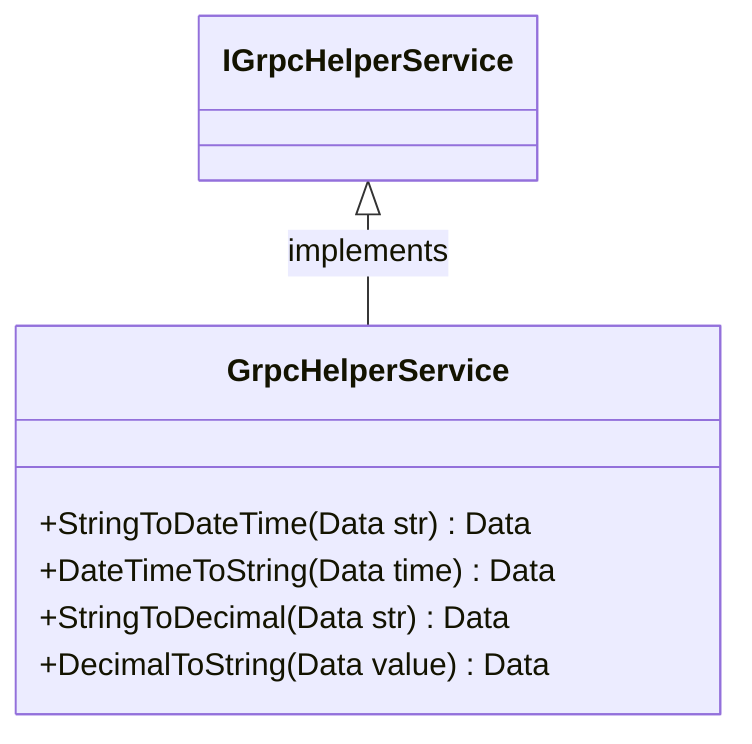
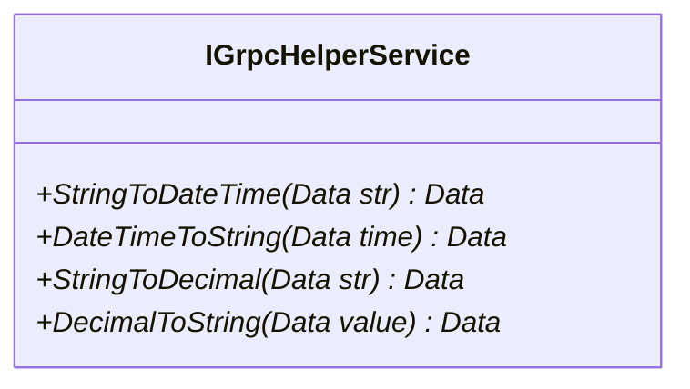
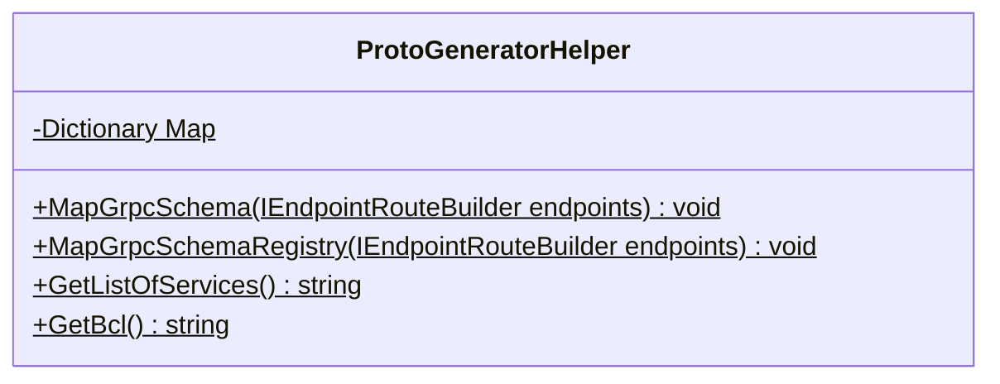

<!-- markdownlint-capture -->
<!-- markdownlint-disable -->

# Code Metrics

This file is dynamically maintained by a bot, *please do not* edit this by hand. It represents various [code metrics](https://aka.ms/dotnet/code-metrics), such as cyclomatic complexity, maintainability index, and so on.

<div id='myjetwallet-sdk-grpcschema'></div>

## MyJetWallet.Sdk.GrpcSchema :heavy_check_mark:

The *MyJetWallet.Sdk.GrpcSchema.csproj* project file contains:

- 1 namespaces.
- 4 named types.
- 214 total lines of source code.
- Approximately 33 lines of executable code.
- The highest cyclomatic complexity is 2 :heavy_check_mark:.

<details>
<summary>
  <strong id="myjetwallet-sdk-grpcschema">
    MyJetWallet.Sdk.GrpcSchema :heavy_check_mark:
  </strong>
</summary>
<br>

The `MyJetWallet.Sdk.GrpcSchema` namespace contains 4 named types.

- 4 named types.
- 214 total lines of source code.
- Approximately 33 lines of executable code.
- The highest cyclomatic complexity is 2 :heavy_check_mark:.

<details>
<summary>
  <strong id="grpchelperservice-datat">
    GrpcHelperService.Data&lt;T&gt; :heavy_check_mark:
  </strong>
</summary>
<br>

- The `GrpcHelperService.Data<T>` contains 3 members.
- 14 total lines of source code.
- Approximately 3 lines of executable code.
- The highest cyclomatic complexity is 2 :heavy_check_mark:.

| Member kind | Line number | Maintainability index | Cyclomatic complexity | Depth of inheritance | Class coupling | Lines of source / executable code |
| :-: | :-: | :-: | :-: | :-: | :-: | :-: |
| Method | <a href='https://github.com/MyJetWallet/MyJetWallet.Sdk.GrpcSchema/blob/master/src/MyJetWallet.Sdk.GrpcSchema/GrpcHelperService.cs#L33' title='Data<T>.Data()'>33</a> | 100 | 1 :heavy_check_mark: | 0 | 0 | 3 / 0 |
| Method | <a href='https://github.com/MyJetWallet/MyJetWallet.Sdk.GrpcSchema/blob/master/src/MyJetWallet.Sdk.GrpcSchema/GrpcHelperService.cs#L37' title='Data<T>.Data(T value)'>37</a> | 96 | 1 :heavy_check_mark: | 0 | 0 | 4 / 1 |
| Property | <a href='https://github.com/MyJetWallet/MyJetWallet.Sdk.GrpcSchema/blob/master/src/MyJetWallet.Sdk.GrpcSchema/GrpcHelperService.cs#L42' title='T Data<T>.Value'>42</a> | 100 | 2 :heavy_check_mark: | 0 | 2 | 1 / 2 |

<a href="#GrpcHelperService.Data&lt;T&gt;-class-diagram">:link: to `GrpcHelperService.Data&lt;T&gt;` class diagram</a>

<a href="#myjetwallet-sdk-grpcschema">:top: back to MyJetWallet.Sdk.GrpcSchema</a>

</details>

<details>
<summary>
  <strong id="grpchelperservice">
    GrpcHelperService :heavy_check_mark:
  </strong>
</summary>
<br>

- The `GrpcHelperService` contains 4 members.
- 37 total lines of source code.
- Approximately 4 lines of executable code.
- The highest cyclomatic complexity is 1 :heavy_check_mark:.

| Member kind | Line number | Maintainability index | Cyclomatic complexity | Depth of inheritance | Class coupling | Lines of source / executable code |
| :-: | :-: | :-: | :-: | :-: | :-: | :-: |
| Method | <a href='https://github.com/MyJetWallet/MyJetWallet.Sdk.GrpcSchema/blob/master/src/MyJetWallet.Sdk.GrpcSchema/GrpcHelperService.cs#L15' title='Data<string> GrpcHelperService.DateTimeToString(Data<DateTime> time)'>15</a> | 91 | 1 :heavy_check_mark: | 0 | 2 | 4 / 1 |
| Method | <a href='https://github.com/MyJetWallet/MyJetWallet.Sdk.GrpcSchema/blob/master/src/MyJetWallet.Sdk.GrpcSchema/GrpcHelperService.cs#L25' title='Data<string> GrpcHelperService.DecimalToString(Data<decimal> value)'>25</a> | 96 | 1 :heavy_check_mark: | 0 | 3 | 4 / 1 |
| Method | <a href='https://github.com/MyJetWallet/MyJetWallet.Sdk.GrpcSchema/blob/master/src/MyJetWallet.Sdk.GrpcSchema/GrpcHelperService.cs#L10' title='Data<DateTime> GrpcHelperService.StringToDateTime(Data<string> str)'>10</a> | 96 | 1 :heavy_check_mark: | 0 | 3 | 4 / 1 |
| Method | <a href='https://github.com/MyJetWallet/MyJetWallet.Sdk.GrpcSchema/blob/master/src/MyJetWallet.Sdk.GrpcSchema/GrpcHelperService.cs#L20' title='Data<decimal> GrpcHelperService.StringToDecimal(Data<string> str)'>20</a> | 96 | 1 :heavy_check_mark: | 0 | 3 | 4 / 1 |

<a href="#GrpcHelperService-class-diagram">:link: to `GrpcHelperService` class diagram</a>

<a href="#myjetwallet-sdk-grpcschema">:top: back to MyJetWallet.Sdk.GrpcSchema</a>

</details>

<details>
<summary>
  <strong id="igrpchelperservice">
    IGrpcHelperService :heavy_check_mark:
  </strong>
</summary>
<br>

- The `IGrpcHelperService` contains 4 members.
- 15 total lines of source code.
- Approximately 0 lines of executable code.
- The highest cyclomatic complexity is 1 :heavy_check_mark:.

| Member kind | Line number | Maintainability index | Cyclomatic complexity | Depth of inheritance | Class coupling | Lines of source / executable code |
| :-: | :-: | :-: | :-: | :-: | :-: | :-: |
| Method | <a href='https://github.com/MyJetWallet/MyJetWallet.Sdk.GrpcSchema/blob/master/src/MyJetWallet.Sdk.GrpcSchema/GrpcHelperService.cs#L53' title='Data<string> IGrpcHelperService.DateTimeToString(Data<DateTime> time)'>53</a> | 100 | 1 :heavy_check_mark: | 0 | 4 | 2 / 0 |
| Method | <a href='https://github.com/MyJetWallet/MyJetWallet.Sdk.GrpcSchema/blob/master/src/MyJetWallet.Sdk.GrpcSchema/GrpcHelperService.cs#L59' title='Data<string> IGrpcHelperService.DecimalToString(Data<decimal> value)'>59</a> | 100 | 1 :heavy_check_mark: | 0 | 4 | 2 / 0 |
| Method | <a href='https://github.com/MyJetWallet/MyJetWallet.Sdk.GrpcSchema/blob/master/src/MyJetWallet.Sdk.GrpcSchema/GrpcHelperService.cs#L50' title='Data<DateTime> IGrpcHelperService.StringToDateTime(Data<string> str)'>50</a> | 100 | 1 :heavy_check_mark: | 0 | 4 | 2 / 0 |
| Method | <a href='https://github.com/MyJetWallet/MyJetWallet.Sdk.GrpcSchema/blob/master/src/MyJetWallet.Sdk.GrpcSchema/GrpcHelperService.cs#L56' title='Data<decimal> IGrpcHelperService.StringToDecimal(Data<string> str)'>56</a> | 100 | 1 :heavy_check_mark: | 0 | 4 | 2 / 0 |

<a href="#IGrpcHelperService-class-diagram">:link: to `IGrpcHelperService` class diagram</a>

<a href="#myjetwallet-sdk-grpcschema">:top: back to MyJetWallet.Sdk.GrpcSchema</a>

</details>

<details>
<summary>
  <strong id="protogeneratorhelper">
    ProtoGeneratorHelper :heavy_check_mark:
  </strong>
</summary>
<br>

- The `ProtoGeneratorHelper` contains 5 members.
- 151 total lines of source code.
- Approximately 26 lines of executable code.
- The highest cyclomatic complexity is 2 :heavy_check_mark:.

| Member kind | Line number | Maintainability index | Cyclomatic complexity | Depth of inheritance | Class coupling | Lines of source / executable code |
| :-: | :-: | :-: | :-: | :-: | :-: | :-: |
| Method | <a href='https://github.com/MyJetWallet/MyJetWallet.Sdk.GrpcSchema/blob/master/src/MyJetWallet.Sdk.GrpcSchema/ProtoGeneratorHelper.cs#L76' title='string ProtoGeneratorHelper.GetBcl()'>76</a> | 100 | 1 :heavy_check_mark: | 0 | 0 | 87 / 1 |
| Method | <a href='https://github.com/MyJetWallet/MyJetWallet.Sdk.GrpcSchema/blob/master/src/MyJetWallet.Sdk.GrpcSchema/ProtoGeneratorHelper.cs#L50' title='string ProtoGeneratorHelper.GetListOfServices()'>50</a> | 63 | 2 :heavy_check_mark: | 0 | 4 | 25 / 12 |
| Field | <a href='https://github.com/MyJetWallet/MyJetWallet.Sdk.GrpcSchema/blob/master/src/MyJetWallet.Sdk.GrpcSchema/ProtoGeneratorHelper.cs#L15' title='Dictionary<string, string> ProtoGeneratorHelper.Map'>15</a> | 93 | 0 :heavy_check_mark: | 0 | 1 | 1 / 1 |
| Method | <a href='https://github.com/MyJetWallet/MyJetWallet.Sdk.GrpcSchema/blob/master/src/MyJetWallet.Sdk.GrpcSchema/ProtoGeneratorHelper.cs#L17' title='void ProtoGeneratorHelper.MapGrpcSchema<TService, TSchema>(IEndpointRouteBuilder endpoints)'>17</a> | 69 | 1 :heavy_check_mark: | 0 | 5 | 16 / 7 |
| Method | <a href='https://github.com/MyJetWallet/MyJetWallet.Sdk.GrpcSchema/blob/master/src/MyJetWallet.Sdk.GrpcSchema/ProtoGeneratorHelper.cs#L34' title='void ProtoGeneratorHelper.MapGrpcSchemaRegistry(IEndpointRouteBuilder endpoints)'>34</a> | 74 | 1 :heavy_check_mark: | 0 | 2 | 15 / 5 |

<a href="#ProtoGeneratorHelper-class-diagram">:link: to `ProtoGeneratorHelper` class diagram</a>

<a href="#myjetwallet-sdk-grpcschema">:top: back to MyJetWallet.Sdk.GrpcSchema</a>

</details>

</details>

<a href="#myjetwallet-sdk-grpcschema">:top: back to MyJetWallet.Sdk.GrpcSchema</a>

## Metric definitions

  - **Maintainability index**: Measures ease of code maintenance. Higher values are better.
  - **Cyclomatic complexity**: Measures the number of branches. Lower values are better.
  - **Depth of inheritance**: Measures length of object inheritance hierarchy. Lower values are better.
  - **Class coupling**: Measures the number of classes that are referenced. Lower values are better.
  - **Lines of source code**: Exact number of lines of source code. Lower values are better.
  - **Lines of executable code**: Approximates the lines of executable code. Lower values are better.

## Mermaid class diagrams

<div id="GrpcHelperService.Data&lt;T&gt;-class-diagram"></div>

##### `GrpcHelperService.Data<T>` class diagram

```mermaid
classDiagram
class Data<T>{
    +T Value
    +) void
    +T value) void
}

```

<div id="GrpcHelperService-class-diagram"></div>

##### `GrpcHelperService` class diagram



<div id="IGrpcHelperService-class-diagram"></div>

##### `IGrpcHelperService` class diagram



<div id="ProtoGeneratorHelper-class-diagram"></div>

##### `ProtoGeneratorHelper` class diagram



*This file is maintained by a bot.*

<!-- markdownlint-restore -->
